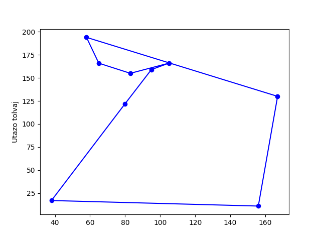
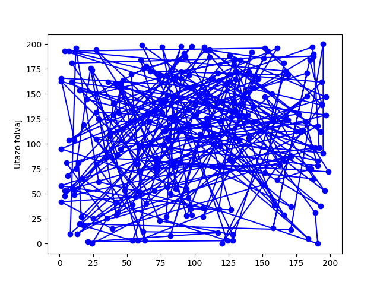
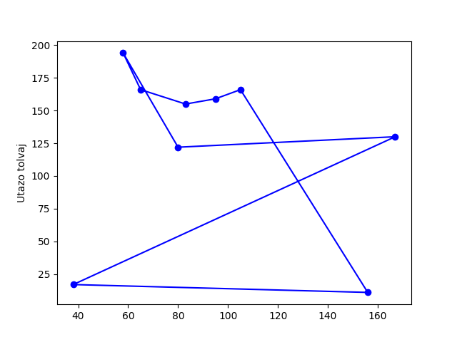
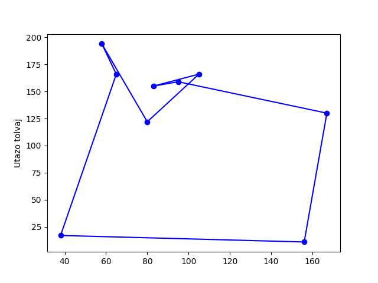
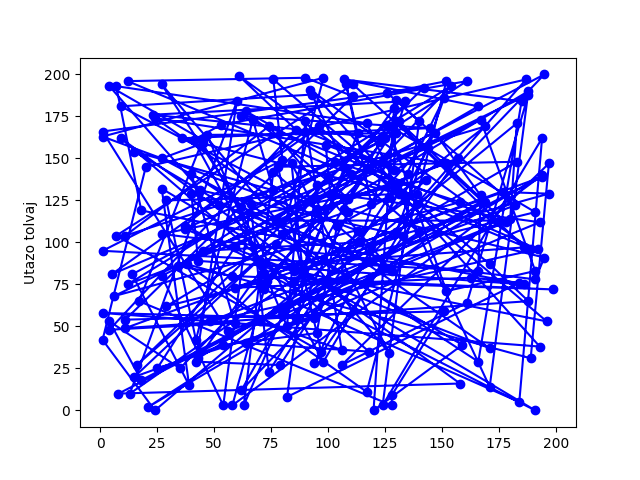

## A probléma leírása
 
Az utazo tolvaj problemaja ket problema kombinacioja, az utazo ugynok problemaja es a hatizsak problemaja.
Az utazo ugynok problema celja az osszes lehetseges telepules egyszeri bejarasa, minimalizalva a tavolsagot.
A hatizsak problemanak celja bizonyos teremekek kombinacionak a keresese, mely erteke nagyobb egy adott osszegnel es egyidejuleg a sulya kisebb egy adott erteknel.
 
## Az algoritmus(ok) leírása
 
Az utazo tolvaj problemajat ket algoritmussal probaljuk megoldani.

Az elso algoritmus a szimulalt lehules.
Ennek leirasa:

    generalunk kezdeti megoldast
    Amig homerseklet nagyobb mint nulla:
        csokkent(homerseklet)
        generalunk veletlen megoldast
        Ha megfelelo megoldas:
            elfogad megoldas

        Ha legjobb megoldas:
            elmentjuk legjobb megoldaskent az elfogadott megoldast

    Visszaterit: legjobb megoldas

A masodik algoritmus egy genetikus algoritmus.
Ennek leirasa;
    
    Eloallitunk egy kezdeti populaciot.
    A populaciobol kivalasztjuk a jobban teljesito felet, ezek fogjak alkotni az uj generacio felet.
    A generacio masik fele a szulok utodai lesznek. Ezek az utodok atesnek egy mutacion.

 
## Paraméterek és tesztesetek
 
Az algoritmus parameterei a varosok szamai, ezen varosokban talalhato termekek szama, a minimum ertek melyet elkell erni es a maximum tomeg, melyet nem haladhat meg a kivalasztott termekek osszsulya. \
Minden varosban talalhato legalabb egy termek.\
A kimenet a legrovidebb ut, mely egy lista a meglatogatot varosokkal es a taskaban leve termekek listaja.

## Eredmények

### Szimulalt lehules

Legrovidebb ut hossz test1.txt bemenetre: 572.540569763253\
Legertekesebb taska erteke test1.txt bemenetre: 76\
Varosok szama: 9\
Aruk szama: 24\
Taskaban levok termekek szama: 8\
Ertek: 2 suly: 11\
Ertek: 9 suly: 13\
Ertek: 4 suly: 7\
Ertek: 13 suly: 7\
Ertek: 11 suly: 8\
Ertek: 15 suly: 7\
Ertek: 7 suly: 3\
Ertek: 15 suly: 5\

Legrovidebb ut hossz test2.txt bemenetre: 1742.1051619310435
Legertekesebb taska erteke test2.txt bemenetre: 95
Varosok szama: 24\
Aruk szama: 39\
Taskaban levok termekek szama: 12\
Ertek: 15 suly: 1\
Ertek: 11 suly: 1\
Ertek: 12 suly: 2\
Ertek: 5 suly: 1\
Ertek: 8 suly: 1\
Ertek: 4 suly: 0\
Ertek: 9 suly: 2\
Ertek: 2 suly: 0\
Ertek: 6 suly: 0\
Ertek: 10 suly: 0\
Ertek: 3 suly: 1\
Ertek: 10 suly: 1\

Legrovidebb ut hossz test2.txt bemenetre: 22867.416860451583\
Legertekesebb taska erteke test2.txt bemenetre: 714\
Varosok szama: 239\
Aruk szama: 573\

### Genetikus algoritmus

Legrovidebb ut hossz test1.txt bemenetre: 725.088775579469\
Legertekesebb taska erteke test1.txt bemenetre: 76\
Kromoszomak szama: 25\
Varosok szama: 9\
Aruk szama: 24\

Legrovidebb ut hossz test1.txt bemenetre: 658.7072315732788\
Legertekesebb taska erteke test1.txt bemenetre: 76\
Kromoszomak szama: 50\
Varosok szama: 9\
Aruk szama: 24\

Legrovidebb ut hossz test2.txt bemenetre: 2195.079713545272\
Legertekesebb taska erteke test2.txt bemenetre: 94\
Kromoszomak szama: 25\
Varosok szama: 24\
Aruk szama: 39\

Legrovidebb ut hossz test2.txt bemenetre: 22867.416860451583\
Legertekesebb taska erteke test2.txt bemenetre: 714\
Kromoszomak szama: 25\
Varosok szama: 239\
Aruk szama: 573\

